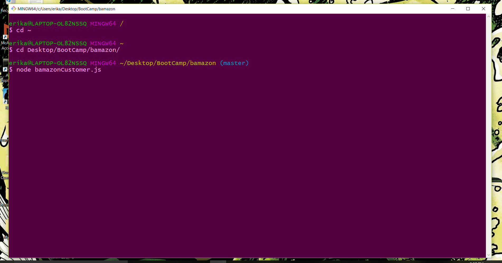
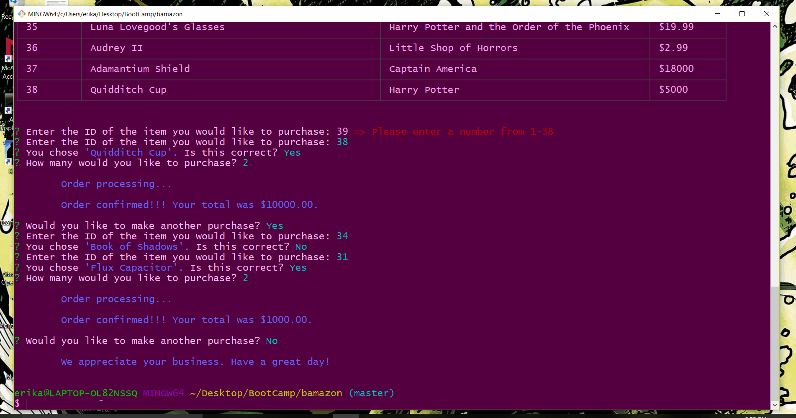
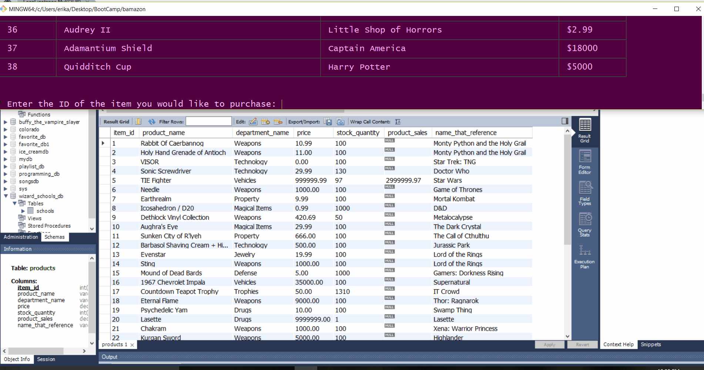

# Welcome to Bamazon

## Your #1 Store For Nerdy Memorabilia!

### This CLI application uses Node.js and MySQL to emulate an online shopping experience.

#### How to Install and Run the Application:

1. Install the app by cloning this repo and navigating to the file in the command line.
2. Remember to `npm install` so the dependencies are loaded to your local copy of the app.
3. Create a database using MySQL called __bamazon_db__.  Use the code in the `schema.sql` file to create your `bamazon_db` database with tables and use the code in `seeds.sql` to populate some amazing nerdtastic/fandom inventory. (Use Workbench, Sequel Pro or MySQL in the command line).
3. There is one dashboard to this application - __Customer View__. Run the application by typing `node bamazonCustomer.js` in the command line. 
4. Follow the prompts to __Make Bamazon Purchases__.
5. Watch the show below:

#### Demos:
1. Main Demo:

2. Out of Stock Warning Demo:

3. Database Update:

- - - 

## TECHNOLOGIES USED
* Javascript
* Nodejs
* Node packages:
    * Chalk
    * Cli-Table
    * Inquirer
    * DotEnv
    * MySQL
* Git
* GitHub